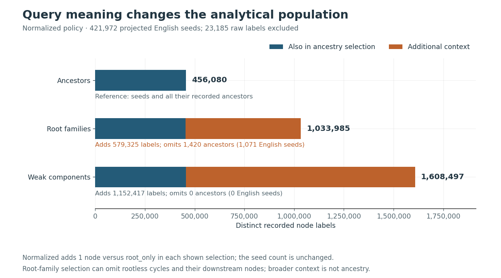

# Polyphasia

**How do relationship and traversal choices change the recorded ancestry of
English words?**

Polyphasia is a reproducible Python pipeline for auditing and analyzing
**6,031,431 Etymological WordNet assertions** with pandas and NetworkX. It keeps
source evidence traceable, makes graph and query policies explicit, and tests
optimized algorithms against equivalent reference results.

On the pinned 2013-02-08 corpus, normalized English ancestry contains **456,080 nodes**.
Root-family context adds **579,325 other nodes** while omitting **1,420 ancestors**,
including 1,071 English seeds. A larger result does not necessarily contain the
smaller one. These are verified properties of this source graph, not a claim
about the complete history of English.

Read the [engineering case study](docs/case-study.md) for the design decisions
and tradeoffs, or inspect the [recorded full run](reports/20130208/README.md) for
counts, figures, source traces, and its manifest.



## What the project demonstrates

| Engineering decision | Evidence |
| --- | --- |
| Preserve assertions before projecting graphs | Input checksums, original record IDs, deterministic aggregation of multiple relationships, and an audit that accounts for retained/excluded information. |
| Name different analytical questions explicitly | Separate ancestor, descendant, root-family, and component queries; cycles remain in the evidence. |
| Optimize equivalent work | Shared traversals and strongly connected components; benchmarks verify input/result fingerprints before reporting time and process memory. |
| Make results inspectable and reproducible | Generated tables and figures, bounded source traces, a run manifest, independent fixture expectations, and notebook execution from a fresh kernel in CI. |

The base package depends on pandas and NetworkX. Plotting and notebook tools are
optional. The [development guide](docs/README-DEV.md) covers tests, type checks,
packaging, and the installed-wheel smoke check.

## Try a meaningful query

Use Python 3.12 and [uv](https://docs.astral.sh/uv/) from the repository root.
This example needs no full dataset, notebook environment, or database:

```sh
uv sync --frozen
uv run --frozen python - <<'PY'
from pathlib import Path

from polyphasia.assertions import prepare_assertions, project_assertions
from polyphasia.loader import load_to_pandas
from polyphasia.queries import ancestor_subgraph, root_family_subgraph

assertions = prepare_assertions(load_to_pandas(Path("examples/sample.tsv")))
graph = project_assertions(assertions, policy="normalized")
seeds = ["eng: example"]

print("Ancestors:", sorted(ancestor_subgraph(graph, seeds)))
print("Root family:", sorted(root_family_subgraph(graph, seeds)))
print("Source record IDs:", graph["lat: exemplum"]["eng: example"]["assertion_ids"])
PY
```

Expected output:

```text
Ancestors: ['eng: example', 'lat: exemplum']
Root family: ['eng: example', 'eng: examples', 'fra: exemple', 'lat: exemplum']
Source record IDs: (1,)
```

The French sibling and English descendant belong to the root family but are not
ancestors of the seed. The three input records are **synthetic**, including the
apparent word relationships; they demonstrate contracts rather than linguistic
truth. [Query contracts](docs/graph-behavior.md) explain views, seed validation,
rootless cycles, and bounded diagnostics.

## Reproduce an analysis in a few minutes

Generate an audited comparison, rankings, source traces, and three figures from
the [37-record synthetic fixture](examples/README.md):

```sh
uv run --frozen --extra analysis python -m polyphasia.analysis \
  examples/analysis-fixture.tsv --output data/processed/portfolio-demo \
  --input-kind synthetic --dataset-version synthetic-v1 \
  --word 'eng: examples' --word 'eng: loop-leaf'
```

Outputs include `audit.json`, `analysis.json`, CSV tables, figures, and a manifest
with input/code/artifact hashes. The output directory must be new; raw data and
ordinary generated runs are Git-ignored.

The [verified notebook](notebooks/verified_analysis.ipynb) can read the published
full-run snapshot without downloading or rebuilding the large graph:

```sh
uv run --frozen --extra notebooks python scripts/execute_analysis_notebook.py \
  --artifacts reports/20130208 \
  --output data/processed/portfolio-full-run.executed.ipynb
```

CI generates the synthetic fixture report and executes that notebook in a fresh
kernel. The [workflow guide](docs/reproducible-analysis.md) gives the full-data
command and provenance boundaries. The recorded full run took 254.46 seconds
and 3.39 GiB process peak RSS on its documented machine; this single execution
is not a hardware requirement or a comparative benchmark.

## Results and limits

Normalizing inverse relations nearly doubles retained assertions but adds only
one node and one edge in this snapshot. Preserving multiple relation types and
choosing the right query matter more here. In the English ancestor selection,
all ten leading word-origin outdegree labels are affix-like, illustrating why
graph degree and source relation labels need careful interpretation.
[The full report](reports/20130208/README.md)
includes both findings and source-linked examples.

On a 512-node synthetic overlap case, median root-family query time was
14.508 ms with repeated traversal and 0.332 ms with shared traversal, measured
across three fresh workers per method. The
[benchmark report](docs/query-benchmarks.md) publishes all repetitions and the
runtime/memory scaling figure. These stress cases do not establish full-corpus
speedups, and process peak memory is not incremental algorithm allocation.

Exact source labels do not disambiguate every sense, historical stage, or
extraction artifact. Assertion counts are not independent corroboration. Code is
MIT-licensed; the [dataset's attribution and CC-BY-SA 3.0 terms](data/data_source_readme.txt)
also apply to its data-derived published artifacts.

## Explore the repository

| Guide | Purpose |
| --- | --- |
| [Case study](docs/case-study.md) | Question, design decisions, findings, performance, and tradeoffs |
| [Recorded run](reports/20130208/README.md) | Verified full-corpus evidence and traceable examples |
| [Reproducible analysis](docs/reproducible-analysis.md) | Fixture/full-data commands, artifacts, and notebook execution |
| [Data audit](docs/data-audit.md) / [format](docs/data-format.md) | Assertion identity, validation, normalization, and loss accounting |
| [Graph behavior](docs/graph-behavior.md) / [benchmarks](docs/query-benchmarks.md) | Query semantics, cycles, and equivalent-result comparisons |
| [Development](docs/README-DEV.md) / [changelog](changelog.md) | Quality checks, packaging, and changes |
| [Notebook index](notebooks/README.md) | Verified analysis versus preserved historical exploration |
| [Neo4j experiment](experiments/README.md) | Optional source-only CSV export; no live database claim |
