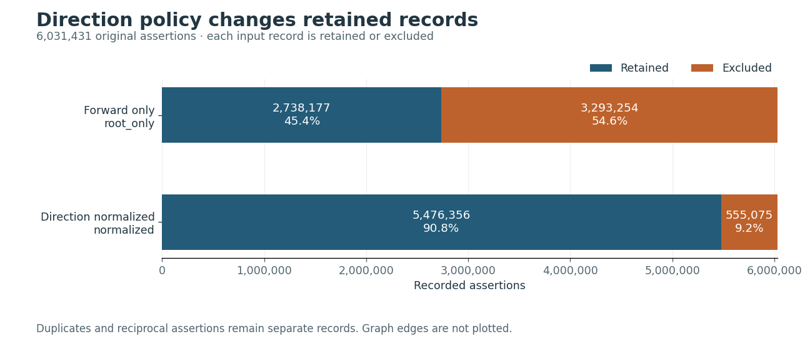
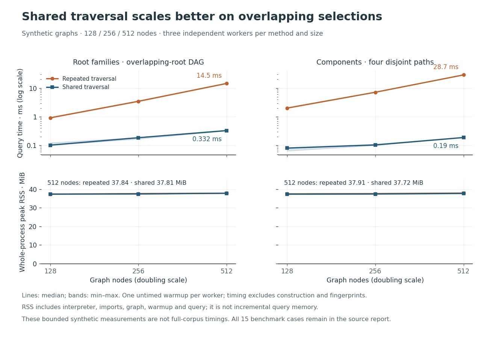

# From exploratory graphs to reproducible evidence

Polyphasia investigates a concrete question: **How do relationship policies and
query definitions change the recorded ancestry and surrounding context of English
words?** On the pinned Etymological WordNet corpus, normalizing inverse
relationships adds just one node and one edge. Changing the query from ancestry
to root-family context adds 579,325 other nodes while omitting 1,420 ancestors.
The most consequential improvement was making the question precise enough to
measure that difference.

The [published full-data run](../reports/20130208/README.md) covers 6,031,431
source records. Its figures, tables, source traces, and original manifest are
available without downloading the corpus.

## Make the model inspectable

The original exploration loaded relationships into simple graphs, filtered out
inverse relationships, and removed cyclic nodes to enable DAG algorithms.
"English-related" could mean ancestors, entire root families, or connected
components. A graph could satisfy its implementation contract while answering a
different analytical question. Simple edges also overwrote distinctions when
multiple relationship types connected the same endpoints.

The revised workflow separates raw assertions, graph projections, and queries.
Every assertion retains its original fields and a record ordinal tied to the
input checksum. Each projected edge aggregates canonical relationship types and
contributing assertion IDs. A `root_only` policy retains forward relationships;
`normalized` also reverses their known inverses. Symmetric and unknown
relationships remain accounted for in the audit, outside ancestry semantics.

The [full audit](data-audit.md#verified-2013-02-08-snapshot) found 46,081 endpoint
pairs carrying both canonical relationship types. It also identified 3,881 cyclic
nodes with 56,622 incident edges: deleting those nodes would discard considerably
more evidence than the reverse-pair assumption misses. The normalized projection
retains 5,476,356 assertions on 2,692,097 edges. Paired inverse records are
recorded evidence, not independent corroboration.

## Give each query one meaning

The API distinguishes ancestors, descendants, root families, and weak components.
Ancestors include seeds and all nodes that can reach them; root families include
every descendant of a zero-indegree root reaching a seed, including sibling
branches. Weak components provide broader undirected context while retaining
the original graph's edge directions.

With the same 421,972 English seeds and cycles retained, normalized ancestry has
456,080 nodes. Root-family context has 1,033,985, but omits 1,071 English seeds
without a path from a zero-indegree root. Weak components have 1,608,497 nodes.
The [pairwise overlaps](../reports/20130208/overlaps.csv) establish how many nodes
are added or omitted; comparing totals alone would miss that root-family context
is not a superset of ancestry. Separately, 23,185 English labels occur only in
assertions excluded from these projections. Complete seed coverage does not
mean complete source coverage.

## Improve algorithms without changing the question

NetworkX remains the graph engine because its traversal, component, and view
primitives support the required contracts. Keeping it made result equivalence
directly testable and avoided coupling semantic changes to an engine migration.
The tradeoff is an in-memory workflow: the full run took 254.46 seconds with
3.39 GiB process peak RSS on the recorded macOS arm64 environment. That is one
execution measurement, not a comparative engine benchmark.

Reachability now shares a visited set across seeds instead of repeating walks
through overlapping ancestry or components. Strongly connected components
identify cyclic membership without enumerating every simple cycle. Condensation
can summarize components as a DAG while retaining membership mappings; its
paths describe component transitions, not word lineages. Ancestry queries
preserve cycles and need neither condensation nor deletion.

The [benchmark suite](query-benchmarks.md) compares equivalent results using
input and selected-set fingerprints, then measures materialized node selections
in fresh workers. All 15 comparisons passed parity checks. On a synthetic chain,
the per-seed baseline grew from 0.845 ms at 128 nodes to 13.588 ms at 512; shared
traversal grew from 0.065 to 0.176 ms. These deliberately overlapping workloads
demonstrate avoided work, not a full-corpus speedup.

Traversal workers used approximately 37.7–37.9 MiB at 512 nodes for both methods;
these measurements do not establish a memory reduction. The cycle comparison's
RSS includes optional pandas/NumPy/SciPy initialization triggered by enumeration
in this environment. It is process high-water memory, not incremental algorithm
allocation. Sub-millisecond timings are also sensitive to noise.

## Inspect surprising results at their source

Within the English ancestor selection, all ten highest outgoing word-origin
entries have leading or trailing hyphens; only three of the top ten derivational
entries do. A relation label therefore does not cleanly separate morphology
from word history. The hyphen flag is a heuristic, and degree counts distinct
direct neighbors rather than historical influence.

The [record-level traces](../reports/20130208/analysis.json) make these limits
concrete. The final `eng: example → eng: examples` edge references records
712902 and 712912. The nearest-root path for `eng: kindness` is
`eng: -ness → eng: kindness`, supported by records 383783 and 856994: one
shortest graph path cannot explain a word's complete history. Normalization
recovers `p_gem: fora → p_gem: forana` from inverse alias record 5149111.
These records were checked against the original TSV; the paths are not
independently validated linguistic lineages. The label model does not distinguish
senses or historical stages, and source text can include extraction artifacts.

## Reproduce the evidence

Start with the [37-record synthetic fixture](../examples/README.md), then use
the [analysis workflow](reproducible-analysis.md) to generate a new run or execute
the verified notebook against the published snapshot. CI executes that notebook
in a fresh kernel on the fixture. Artifact checksums, implementation hashes,
parameters, environment, and execution measurements accompany each completed
run. The notebook consumes those artifacts; it never silently launches full-data
analysis. The [full-corpus command](reproducible-analysis.md#run-the-full-pinned-corpus)
pins the input checksum, and the [upstream attribution and license](../data/data_source_readme.txt)
remain separate from the code's MIT license.
