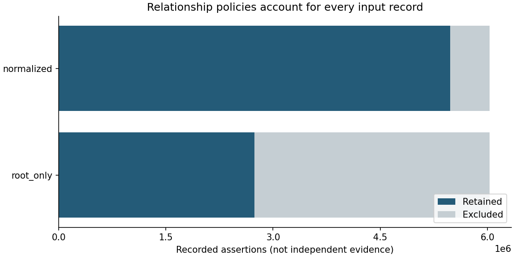
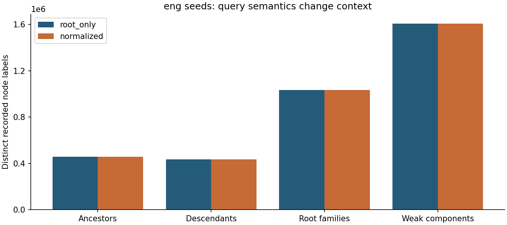
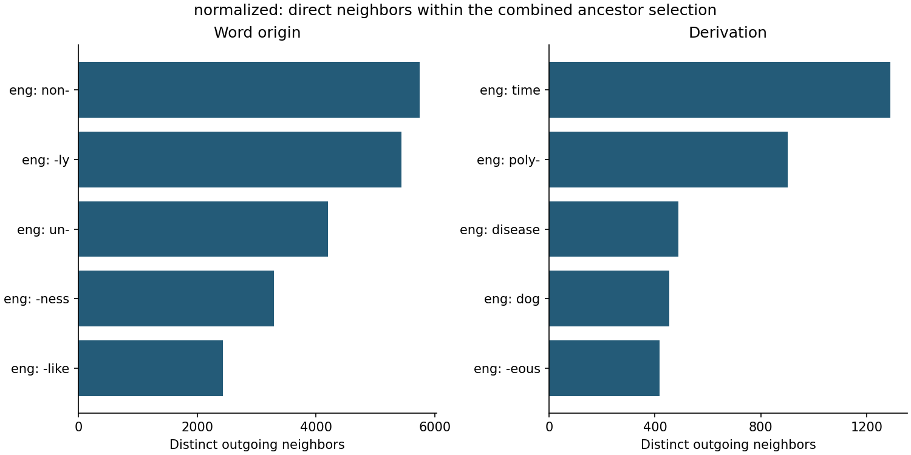

# Full Etymological WordNet analysis

**Query meaning changes the result much more than inverse normalization does in
this snapshot.** Normalizing inverse relationships adds one node and one edge.
Changing from English ancestry to root-family context adds 579,325 other nodes
while omitting 1,420 ancestors. Context is not a superset of ancestry.

This run covers all **6,031,431 records** from Etymological WordNet 2013-02-08.
It was generated from clean commit
[`43ac9e8`](https://github.com/jmcummings77/polyphasia/commit/43ac9e8b96d3be0c871127f4f7c68594578f6b0a)
on 2026-10-04 UTC. [manifest.json](manifest.json) records the full input checksum,
parameters, implementation hashes, versions, artifact hashes, and measurements.
The raw TSV is not included in this repository.

## Relationship policies and coverage

The input contains **445,157 distinct English labels**, of which **421,972** are
endpoints of retained ancestry assertions under either policy. The other 23,185
labels are absent from these projections, so query seed coverage must not be
mistaken for coverage of every English label in the source.

| Metric | Root-only | Inverse-normalized |
| --- | ---: | ---: |
| Retained assertions | 2,738,177 | 5,476,356 |
| Projected nodes | 2,743,118 | 2,743,119 |
| Projected endpoint pairs | 2,692,096 | 2,692,097 |
| English seeds | 421,972 | 421,972 |
| Cyclic nodes retained | 3,881 | 3,881 |

Every unique forward origin fact has an inverse. Derivation has one inverse-only
pair, recovered from a `rel:derived` alias. The retained assertion count nearly
doubles with normalization, but paired records are not independent corroboration.
Both graphs preserve 46,081 endpoint pairs carrying both canonical relationship
types. The complete [audit](audit.json) exactly matches the earlier phase 1 full
audit; no cyclic nodes were deleted.



## Queries with the same English seeds

| Query | Root-only nodes / edges | Normalized nodes / edges | Included English seeds |
| --- | ---: | ---: | ---: |
| Ancestors | 456,079 / 457,125 | 456,080 / 457,126 | 421,972 |
| Descendants | 433,934 / 429,023 | 433,934 / 429,023 | 421,972 |
| Root families | 1,033,984 / 1,047,989 | 1,033,985 / 1,047,990 | 420,901 |
| Weak components | 1,608,496 / 1,690,681 | 1,608,497 / 1,690,682 | 421,972 |

The normalized ancestor and root-family selections overlap at **454,660 nodes**.
Root families omit 1,420 ancestors, including 1,071 English seeds without a path
from a zero-indegree root, and add 579,325 nodes from broader family context.
Weak components contain the entire ancestor selection plus **1,152,417** other
nodes. These are properties of the selected source graph, not historical
language populations. [queries.csv](queries.csv) and [overlaps.csv](overlaps.csv)
provide all counts and six pairwise comparisons per policy.



## Relationship-specific rankings

Both rankings use the same combined English ancestor selection and count
distinct direct neighbors, not assertion multiplicity or all reachable words.
The normalized selection contains 192,406 word-origin facts and 277,844
derivational facts. A pair carrying both types contributes to both categories.

All ten highest outgoing word-origin entries carry the simple affix-like label
flag. The first five are `eng: non-` (5,742 neighbors), `eng: -ly` (5,438),
`eng: un-` (4,203), `eng: -ness` (3,295), and `eng: -like` (2,437).
Derivational outdegree instead starts with `eng: time` (1,289), `eng: poly-`
(902), and `eng: disease` (489); three of its top ten entries carry that flag.
These results show that separating source relation labels does not by itself
cleanly separate morphological constructions from word histories.

The flag checks only a leading or trailing hyphen; it is not an independently
validated morphological classification. Incoming derivation rankings also
contain markup-like labels such as `eng: noun-->` (11 neighbors). The pipeline
preserves such source text rather than silently treating it as a cleaned lexical
entity. Inspect [rankings.csv](rankings.csv) before making linguistic claims;
neither degree nor source frequency is a measure of historical influence.



## Examples traced to source assertions

These are deterministic nearest-root graph paths, not independently verified
histories. The full paths, raw fields, record IDs, and reversal flags are in
[analysis.json](analysis.json). Each ordinal is tied to the input SHA-256 in
the manifest.

- `eng: examples`: `lat: exemptus → lat: exemplum → fro: essample → enm: example
  → eng: example → eng: examples`. The final derivational edge is supported by
  records **712902** and **712912**, a forward/inverse pair under normalization.
- `eng: kindness`: the nearest-root path is `eng: -ness → eng: kindness`, with
  source records **383783** and **856994**. This intentionally illustrates why
  one shortest path is not a complete account of a word's history.
- `p_gem: forana`: root-only treats this node as a root (a zero-edge path).
  Normalization recovers `p_gem: fora → p_gem: forana` from inverse alias record
  **5149111**, adding the missing ancestor instead.

Every sampled raw record in these traces was independently compared with its
ordinal in the original TSV after the run. Queries preserve source cycles;
bounded tracing reports `bounded` rather than inferring rootlessness if its
depth or visited-node budget is exhausted.

## Reproduce or inspect

Follow the [full-corpus command](../../docs/reproducible-analysis.md#run-the-full-pinned-corpus)
to regenerate these artifacts into a new directory. To inspect this published
snapshot without the raw download:

```sh
uv run --frozen --extra notebooks python scripts/execute_analysis_notebook.py \
  --artifacts reports/20130208 \
  --output data/processed/published-full-run.executed.ipynb
```

The notebook was also executed successfully against the original full run in a
fresh kernel. Analytical artifacts total about 234 KiB. The complete workflow
took **254.46 seconds**, with **3,641,344,000 bytes (3.39 GiB)** process peak RSS
on Python 3.12.9 / NetworkX 3.3 / pandas 2.2.0 / macOS arm64. This is a single
execution measurement including loading, audit, analysis, and rendering, not a
comparative benchmark or a guaranteed resource requirement.

## Source and reuse

Source: Gerard de Melo's Etymological WordNet 2013-02-08, based primarily on
English Wiktionary contributions with manual additions. Attribution, citation,
and **CC-BY-SA 3.0** source terms are preserved in the
[upstream README](../../data/data_source_readme.txt). Data-derived artifacts and
source assertion excerpts in this directory are shared under those terms; the
repository's MIT code license does not replace the dataset's license. This run
normalizes directions and aggregates assertions; it does not correct or certify
the source's linguistic claims, coverage, sense distinctions, or historical dates.
